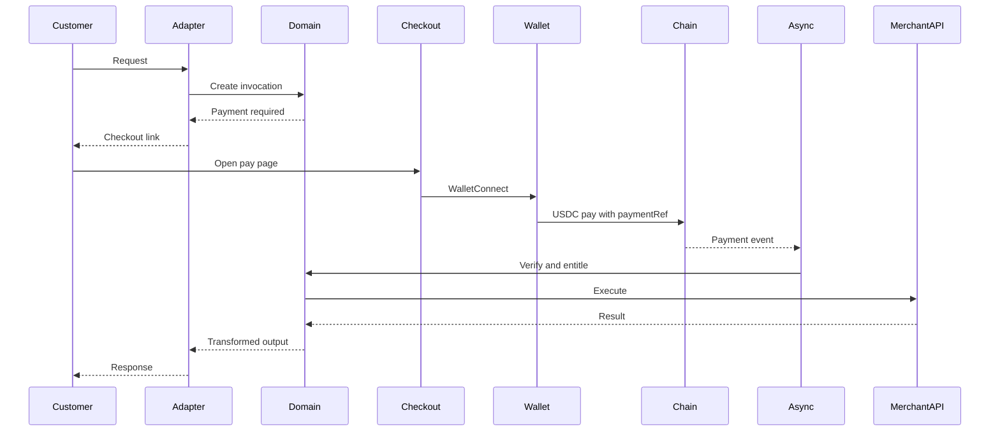

# Data flow

This document traces how data moves through Obscurus. Companion reading: [Invocation flow](../protocol/invocation-flow.md), [Payment flow](../protocol/payment-flow.md), [Privacy model](../privacy/privacy-model.md).

## End-to-end happy path

A customer asks a channel to run a paid endpoint. Obscurus creates an invocation, discovers no entitlement, creates a payment, and returns a checkout link. After on-chain USDC payment, the async consumer verifies, creates an entitlement, calls the merchant API, transforms the result, and replies on the original channel. The customer does not retype the command.



Telegram, MCP, HTTP 402, and hosted checkout all enter at `Adapter` and leave through `Adapter`. Core domain code does not import Telegram or MCP libraries.

## Merchant configuration flow

1. Merchant authenticates to the dashboard.
2. Merchant creates a project.
3. Merchant pastes a cURL command. The importer **parses** it into method, URL, headers, and body. It never executes the command.
4. Likely secrets (Authorization, API keys) are flagged and moved into SecretProvider.
5. Merchant marks which JSON fields are customer inputs. Literals become `{{input.field}}`. An InputSchema is generated.
6. Merchant sets a `PER_REQUEST` price.
7. Merchant optionally maps the response (passthrough, JSONPath-style selection, or a text template).
8. Merchant enables channels and publishes. Publishing freezes an EndpointVersion.

Configuration data lives in D1. Secret plaintext never does. Logos go to R2 after MIME, size, and dimension checks.

## Invocation data

An invocation record holds:

- `invocation_id`, `endpoint_id`, `endpoint_version_id`
- customer **input** (fulfillment data)
- **service identity** reference, opaque, adapter-private
- status, timestamps, `request_id`
- optional payment_id and entitlement_id once they exist

The adapter may keep channel routing data (Telegram `chat_id`, MCP session) keyed by the service identity reference. That table is not joined in merchant SQL views.

## Payment data

A payment record holds amount, asset, state, opaque `paymentRef`, expiry, and restricted payment identity columns (payer address, tx hash). Merchant list views select amount, asset, state, endpoint, and timestamps. They do not select payer address.

The Durable Object named by `payment_id` serializes `VerifyPayment` and expiry. D1 is what the dashboard reads after the transition commits.

## Entitlement and resume

When verification succeeds:

1. Durable Object for `payment_id` moves `CONFIRMING` → `PAID` once.
2. D1 writes the payment row and a single-use entitlement bound to the invocation (or to the versioned endpoint, depending on pricing; MVP is per-invocation).
3. Queue message `invocation.resume` is sent.
4. Durable Object for `invocation_id` claims fulfillment once.
5. HTTP executor loads secrets, renders the structured request, applies SSRF policy, calls the merchant API, enforces time and size limits.
6. Response transformer produces adapter output.
7. Adapter delivers. Invocation becomes `FULFILLED`.
8. Optional merchant webhook fires with fulfillment data only.

If step 5 fails, the invocation is `FAILED`. The entitlement is not silently reused. Retry policy is an explicit later decision; the invariant is “no double execution,” not “infinite retry.”

## What is persisted

**Always (D1):** merchants, projects, endpoints, versions, encrypted secret metadata and ciphertext, payments, entitlements, invocation metadata, webhook delivery state, audit events.

**Restricted columns / tables:** payer address; hashed service identity; short-TTL invocation payloads.

**R2:** merchant logos.

**KV:** rate-limit counters, checkout tokens, idempotency keys.

**Durable Object storage:** in-flight coordination for that payment or invocation. Not the merchant data warehouse.

**Never plaintext anywhere:** merchant API keys, Telegram bot tokens, signing keys, webhook secrets, wallet private keys, card data (out of scope).

## What is logged

Default structured fields: `request_id`, `trace_id`, `endpoint_id`, `payment_id`, `invocation_id`, status, error class.

Never logged by default: secrets, `Authorization` headers, bot tokens, private keys, raw cURL, full wallet addresses, Telegram user IDs, request bodies.

A temporary debug flag may log redacted payloads with a TTL. That flag is off in production unless an incident requires it. Phase 14 implements structured redaction; this document is the policy.

## What each party sees

**Obscurus** stores merchant configuration, encrypted secrets, invocation inputs needed to call the merchant API, service identity needed to reply, payment identity needed to verify the chain, and the internal join across those records.

**Merchant** receives operation, customer-supplied inputs, verified payment amount and asset, and identifiers for the request and entitlement. Not the payer wallet by default.

**Blockchain** shows payer address, settlement destination, amount, asset, timestamp, and opaque `paymentRef`. The WalletConnect MVP creates a public payer-to-merchant-wallet link. See [Privacy model](../privacy/privacy-model.md).

**Telegram** sees user and chat identity, command text, the pay link, and bot messages. Telegram does not verify USDC.

**MCP client** sees tool schema, price metadata, payment requirement, and result. If the agent pays from a wallet it controls, that client also sees payment identity.

**Wallet / WalletConnect** sees destination, amount, and calldata including `paymentRef` and possibly the merchant address.

## HTTP 402 sketch

Without entitlement, `POST /v1/invoke/{endpoint}` returns `402` with Obscurus-native body:

```json
{
  "error": "payment_required",
  "payment": {
    "id": "pay_x82",
    "amount": "0.02",
    "asset": "USDC",
    "checkout_url": "https://checkout.obscurus.example/pay/pay_x82"
  }
}
```

The public protocol stays extensible. Coinbase x402 is noted as a later envelope, not a facilitator dependency. Obscurus verifies payments itself.

## Webhook sketch

Optional merchant events: `payment.created`, `payment.confirmed`, `invocation.started`, `invocation.completed`, `invocation.failed`.

Payloads carry fulfillment data. They do not carry wallet identity unless an endpoint explicitly requires and discloses it.

Delivery uses `X-Obscurus-Signature` and `X-Obscurus-Timestamp`, timestamp tolerance, replay protection, idempotency keys, exponential backoff, and a dead-letter state. The merchant must not treat an unsigned browser callback as payment proof.
