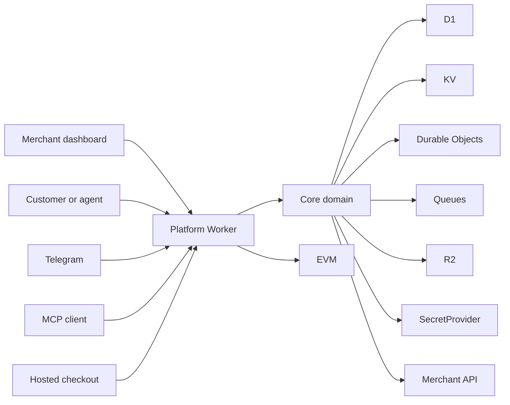
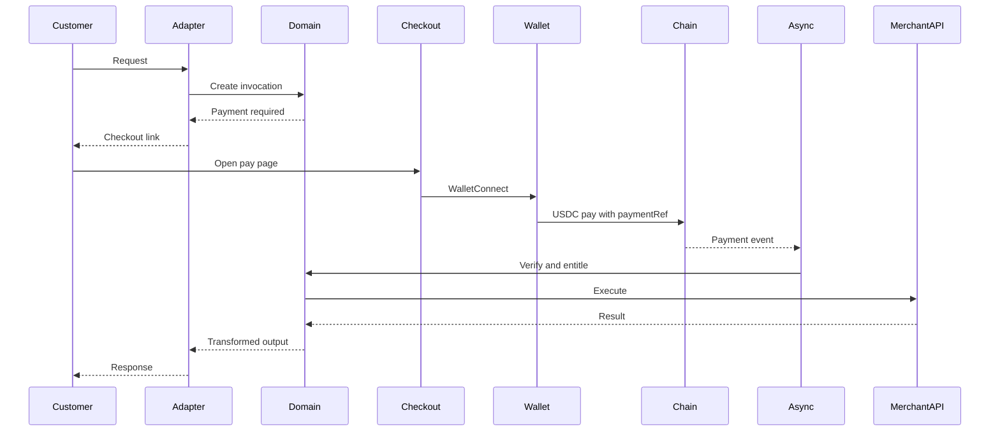
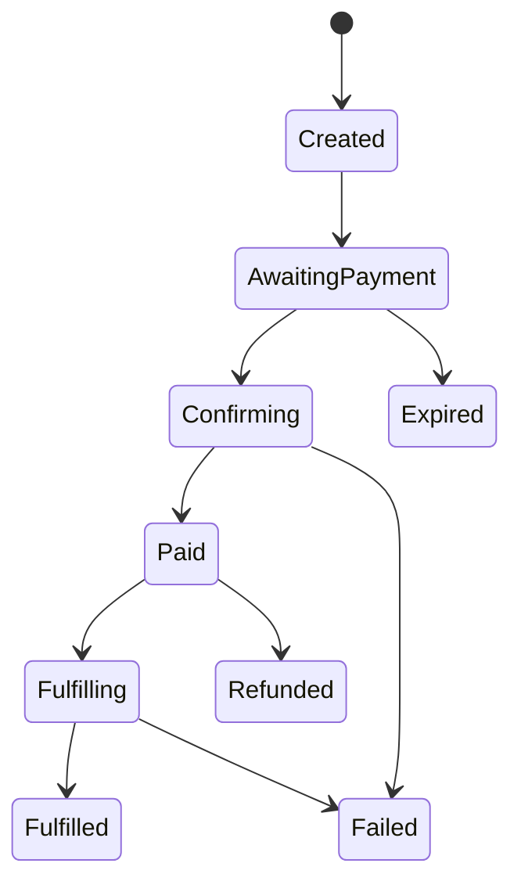
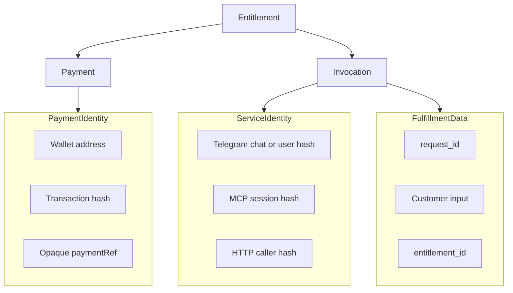

# Architecture overview

Obscurus is a TypeScript modular monolith on Cloudflare Workers. D1 is the system of record. Integrations are adapters. Payment, entitlement, and HTTP execution live in the core domain.

The product rule that everything else serves:

**Share only what is required to provide the service.**

## Why this stack

Obscurus is hosted on Cloudflare Workers and D1. Workers run JavaScript and TypeScript in V8 isolates. Go is not a first-class Workers runtime for a product of this shape. WASM Go would add toolchain risk without operational gain.

Therefore:

- Application code is TypeScript.
- `nodejs_compat` is enabled where libraries need Node built-ins.
- Frontends are Next.js, deployed to Workers.
- Persistence is D1, not PostgreSQL.
- Coordination uses Durable Objects, KV, and Queues, not Redis.
- Smart contracts remain Solidity in Foundry. They are not Cloudflare services.

This is a hosting decision, not a product decision. The domain model would be the same on another runtime.

See [ADR-0001](decisions.md#adr-0001--typescript-on-cloudflare-workers) and [ADR-0002](decisions.md#adr-0002--one-platform-worker).

## System map

Merchant UI talks to the merchant API surface. Customers, Telegram, and MCP clients talk to the gateway surface. Both surfaces call the same core domain. Background work runs in the same Worker through Queues and Cron.

Component map of the Cloudflare deployment:



## Repository layout

Operationally simple. Modular in packages. Not a mesh of microservices.

```
obscurus/
  apps/
    dashboard/          Next.js merchant console
    checkout/           Next.js hosted checkout
    website/            public site, docs, privacy center
  services/
    platform/           Cloudflare Worker: fetch, queue, scheduled
  packages/
    core/               domain logic, no Cloudflare imports
    db/                 D1 schema, migrations, repositories
    api-types/          generated OpenAPI types
    ui/                 design system
    config/             shared TypeScript config
    client/             later public SDK
  contracts/            Foundry, Phase 5
  integrations/         adapter docs and examples, not separate runtimes
  docs/
  examples/
  deployments/          wrangler environments
```

`packages/core` must not import `cloudflare:workers`. Persistence, bindings, and `fetch` live behind ports. That keeps domain tests honest and prevents Telegram or D1 details from leaking into entitlement logic.

## Process responsibilities

There is one deployable Worker with three handlers. The names `api`, `gateway`, and `worker` remain as **logical** surfaces.

**Merchant API (`fetch`, authenticated)**

- Merchant registration and sessions
- Projects, endpoints, secrets, branding
- Invocation inspection
- Never serves customer checkout
- Never exposes payment identity in default views

**Gateway (`fetch`, public)**

- Hosted checkout JSON
- HTTP invoke and HTTP 402
- Telegram webhook receiver
- MCP transport
- Creates invocations; never treats `paid=true` from a client as truth

**Async consumer (`queue` + `scheduled`)**

- Payment verification
- Entitlement creation
- Invocation resume
- Webhook delivery with backoff
- Expiry of `AWAITING_PAYMENT`

Worker-to-worker HTTP is forbidden if we later split these surfaces. Use service bindings.

Frontends:

- `dashboard` — merchant only, calls merchant API
- `checkout` — customer payment UI, no merchant secrets
- `website` — marketing, documentation, `/privacy`

## Core domain

### Entities

Merchant, Project, Endpoint, EndpointVersion, InputSchema, PricingRule, Payment, Entitlement, Invocation, Integration, Webhook, Settlement, BrandingConfiguration, Secret, AuditEvent.

### Endpoint

An Endpoint is an HTTP operation the merchant wants to monetize.

Example:

- Name: `person_search`
- Input: `{ "query": "string" }`
- Price: `0.50 USDC` per request
- Merchant request: `POST https://merchant.example/search` with `{ "query": "{{input.query}}" }`

The HTTP executor runs that request only after an entitlement exists.

Published `EndpointVersion` rows are immutable. Changing URL, headers, schema, price, or mapping writes a new version. In-flight entitlements stay bound to the version they were purchased against.

Pricing in the MVP is `PER_REQUEST`. The schema reserves `CREDIT_PACK`, `SUBSCRIPTION`, and `ONE_TIME_UNLOCK` without implementing them.

### PaymentProvider

Domain interface, no chain types:

- `CreatePayment`
- `VerifyPayment` — idempotent
- `GetPayment`
- `Refund` — reserved, unimplemented

Phase 1 implements `MockPaymentProvider` only. EVM verification is a later adapter behind the same interface.

### Invocation pipeline

Every adapter terminates in the same pipeline:

Input → Invocation → Entitlement check → Payment gate → Verify → HTTP executor → Transform → Output adapter



### Payment state machine

API and D1 use the uppercase names. The diagram uses CamelCase so Mermaid stays valid.



Invariants:

- Payment verification is idempotent.
- Fulfillment is idempotent.
- A single-use entitlement cannot execute twice.
- The merchant API runs only after an entitlement exists.

Durable Objects enforce the last two under concurrency. D1 remains the record that dashboards and webhooks read.

## Identity separation

Three domains. Obscurus may correlate them internally to resume work. Merchant-facing APIs and webhooks must not.



Merchant payload, by default:

```json
{
  "request_id": "...",
  "input": { "query": "John Smith" },
  "payment": {
    "verified": true,
    "amount": "0.50",
    "asset": "USDC"
  }
}
```

Not included by default: wallet address, wallet history, email, phone, name, Telegram user id.

On-chain: opaque `paymentRef`, merchant settlement address, asset, amount, protocol fee. Never Telegram IDs, names, emails, query text, API arguments, or merchant API URLs.

## Cloudflare mapping

| Need | Primitive | Not used for |
| ---- | --------- | ------------ |
| Domain entities | D1 | Ephemeral locks |
| Strongly consistent payment/invocation transitions | Durable Object keyed by id | Global singleton object |
| Rate limits, checkout tokens, idempotency TTL | KV | Payment truth |
| Verify, resume, webhook retry | Queues | Synchronous HTTP |
| Payment expiry | Durable Object alarm, plus cron sweep | Client timers |
| Merchant logos | R2 | Arbitrary merchant HTML |
| Platform keys | Secrets Store / `wrangler secret` | Merchant API keys in the browser |
| Local + deploy | Wrangler, Miniflare | Kubernetes, Docker Compose as the production control plane |

PostgreSQL and Redis are not part of the MVP. If D1 later proves insufficient, Hyperdrive to an external database is an explicit future ADR, not a silent fork.

## Smart contracts

Phase 5 introduces one EVM testnet and one USDC-style ERC-20. Recommended: Base Sepolia and Circle USDC. The contract records `paymentRef`, merchant, asset, amount, fee, and emits an event. It does not store application-private data.

WalletConnect AppKit connects a wallet. Obscurus verifies its own contract events. WalletConnect Pay is not the processor.

No Obscurus token. No staking. No speculative tokenomics.

## MVP boundary

Documented now, built only after phase-by-phase approval.

**In MVP (later phases):** merchant platform, cURL importer, payment state machine, Base testnet USDC contract, WalletConnect checkout, privacy inspector, dashboard, Telegram adapter, MCP adapter, HTTP 402, webhooks, observability, public privacy center, open-source hygiene.

**Out of MVP:** Obscurus Wallet, balances, passkeys, fiat, Apple Pay, Google Pay, auto-pay, agent spending policy enforcement beyond design, custom cryptography, privacy-preserving settlement, Discord, Slack, Kubernetes.

## What we will not do

- Execute imported cURL through a shell
- Trust `paid=true` from a browser, Telegram, or MCP client
- Log secrets, bot tokens, or default wallet / Telegram identifiers
- Put query text or personal identifiers on-chain
- Claim blockchain anonymity for the WalletConnect MVP
- Ship a token to justify the chain integration
