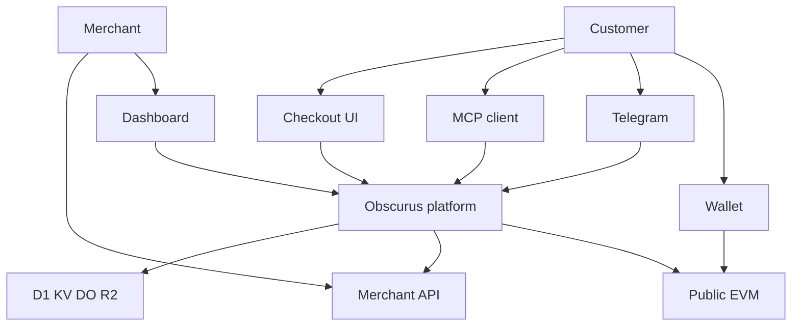

# Trust boundaries

Obscurus is a payment intermediary. Most participants are hostile or compromised in at least one scenario. Trust is explicit and narrow.

Actors: Customer, Merchant, Obscurus platform (fetch, queue, scheduled, D1, KV, Durable Objects, R2, secrets), Blockchain, Wallet, Telegram, MCP client, Merchant API, Cloudflare as infrastructure.

The diagram is a trust map, not a deployment diagram. Every edge is a disclosure or a control point.

## What each zone is trusted for

**Customer / wallet** — trusted for intent to pay. Not trusted for payment truth, entitlement, or merchant secrets. A customer can replay, refuse to pay, or submit hostile input.

**Merchant dashboard** — trusted for that merchant’s own configuration. Not trusted to execute other merchants’ payments, read other tenants, or inject JavaScript into checkout.

**Gateway fetch handler** — trusted to accept invocations and to return checkout URLs. Not trusted if a client sends `paid=true`. Payment truth is server-side verification only.

**Async consumer** — trusted to observe chain events and to drive fulfillment. Not trusted to handle plaintext secrets outside SecretProvider. A compromised consumer is a first-class threat. See [Threat model](../security/threat-model.md).

**D1** — trusted as the system of record **if** the Worker and Cloudflare account are intact. A compromised database dumps ciphertext and metadata. SecretProvider and least-privilege tokens limit blast radius; they do not make D1 a cryptographic vault for all data.

**Durable Object** — trusted to serialize transitions for one payment or one invocation. Not trusted as a place to store merchant API keys or wallet mnemonics.

**KV** — trusted for TTL’d coordination, not for financial truth.

**Blockchain** — trusted for “a transfer of this asset and amount occurred in this transaction.” Not trusted for privacy, for the meaning of `paymentRef`, or for off-chain identity. Anyone can watch the chain.

**Telegram** — trusted as a message transport. Not trusted for payment verification, for keeping bot tokens, or for privacy from Telegram the company.

**MCP client** — trusted as a tool host the user or agent already runs. Not trusted to spend without an authorization step. Not trusted with merchant secrets.

**Merchant API** — trusted to produce the purchased bytes. Not trusted to pick a safe URL (SSRF). Not trusted as HTML to render unsanitized. Redirects, huge bodies, and unexpected content types are hostile.

**Cloudflare** — trusted as the compute and storage operator in the MVP. This is a real centralization and privacy assumption. Obscurus employees and Cloudflare operators are distinct from merchants, but they are not the customer. Access to production must be role-based and audited. Stronger payment privacy later still has to name this assumption.

**Checkout frontend** — trusted to display amount and to open WalletConnect. Not trusted as a source of payment confirmation. Bundled third-party scripts are a supply-chain threat.

## Boundary crossings

Every arrow that leaves Obscurus is a disclosure.

| Crossing | Data that may cross | Data that must not cross |
| -------- | ------------------- | ------------------------ |
| Gateway → customer | Payment requirement, checkout URL, transformed result | Merchant secrets, other customers’ data |
| Checkout → wallet | Amount, asset, destination, `paymentRef` | Merchant API URL, query text, Telegram id |
| Wallet → chain | Standard public transaction | Application-private fields |
| Platform → merchant API | Rendered input, Obscurus request id, verified payment summary | Payer wallet, Telegram id, Obscurus signing keys |
| Platform → merchant webhook | Event type, payment id, endpoint, amount, asset, request id | Wallet identity by default |
| Platform → Telegram | Bot messages, pay button URL, result text | Wallet address, other users’ data |
| Dashboard → browser | Merchant config with secret **redaction** | Full bot tokens, API keys, customer wallets |

## Payment truth

Payment truth is a server-side function of:

1. A payment row Obscurus created (`paymentRef` unique)
2. An on-chain event (or mock provider result) that matches `paymentRef`, asset, and amount
3. An idempotent transition into `PAID`
4. An entitlement row

None of these steps may be replaced by a query parameter, a Telegram callback data flag, or a checkout `postMessage`.

## Cloudflare-specific boundaries

Workers `fetch` to the merchant API leaves the isolate. SSRF policy still applies. Do not assume the edge “cannot” reach private IPs; enforce an allow/deny policy in the HTTP executor.

Bindings (D1, KV, R2, Queues, Durable Objects, Secrets) are in-process capabilities. Code must not call the Cloudflare REST API with an API token to read the same data. Tokens that exist for Wrangler deploy must not be in the Worker `Env`.

`wrangler secret` values are available to the Worker. They must never be copied into D1 logs, client HTML, or MCP tool results.

## Admin

A future platform admin UI is a separate trust zone from the merchant dashboard. Admins do not receive customer wallets or Telegram IDs in default views. Sensitive admin actions emit AuditEvents. Admin is not in the MVP.
