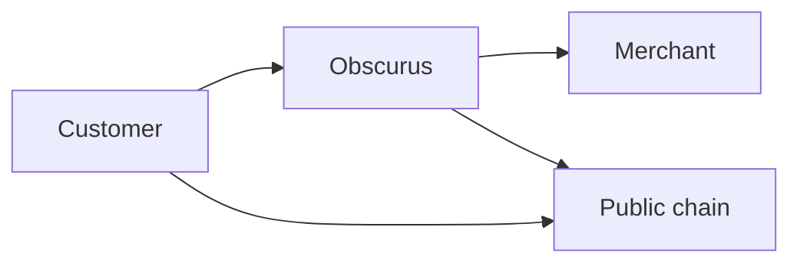

# Privacy model

**Prove you paid. Not who you are.**

Privacy in Obscurus is data minimization and the separation of **service identity** from **payment identity**. It is not a promise of untraceable money.

If a sentence cannot be traced to a control in this document or in the [security model](../security/security-model.md), do not put it on the website.

## The promise that is true

**Your payment identity is not shared with the merchant by default.**

Obscurus does not send the merchant:

- wallet address
- wallet history
- email
- phone
- name
- Telegram user id
- unrelated purchase history
- payment method details beyond amount and asset

unless the endpoint **explicitly** configures that attribute and checkout **discloses** it.

The merchant does receive what they need to fulfill:

- requested operation
- customer-supplied inputs
- that payment is verified
- amount and asset
- request and entitlement identifiers

## The promise that is false for the MVP

Do not say, imply, or allow sales copy to say:

- untraceable money
- sanctions, AML, or tax avoidance
- hiding transactions from authorities
- anonymous illegal payments
- bypassing financial controls
- blockchain-level anonymity
- unlinkability of payer and merchant wallets

The MVP pays USDC on a public EVM network through WalletConnect. A public observer can see a wallet send a visible amount to a visible settlement address, with an opaque `paymentRef` in calldata. Checkout repeats this on the **What is shared?** inspector so customers are not sold a stronger privacy story than the chain provides.

Merchant privacy and blockchain anonymity are different properties. This product ships the first. It does not ship the second.

## Three data planes

**Service data** — channel identity and routing: Telegram chat, MCP session, HTTP caller. Needed to reply. Not for the merchant.

**Fulfillment data** — inputs and entitlement. Needed by the merchant API.

**Payment data** — wallet, tx hash, `paymentRef`. Needed to verify. Not for the merchant by default.

**Blockchain data** — public by nature of the MVP rail. Obscurus does not make it private by omitting it from a JSON response.

Obscurus internally joins these planes so payment can resume an invocation. That join is a platform privilege. It is not a merchant privilege.

## What each party knows (MVP)

### Obscurus

- Merchant accounts, endpoint configuration, encrypted secrets
- Invocation inputs required to call the merchant API
- Service identity required to respond on the originating channel
- Payment identity required to verify the chain
- Correlation among invocation, payment, and entitlement
- Cloudflare operates the computers. That is a trust assumption. See [trust boundaries](../architecture/trust-boundaries.md).

### Merchant

- Operation, inputs they defined, verified amount and asset, `request_id`
- Not payer wallet by default
- Their own logs of *their* API, which may contain whatever their service records when Obscurus calls it — Obscurus cannot prevent a merchant from logging `query`

### Blockchain

- Payer address, settlement destination, amount, asset, time, opaque reference
- Public **payer → merchant wallet** link in the MVP

### Telegram

- User and chat identity, message text, that a pay link was sent, bot replies
- Telegram’s privacy policy applies. Obscurus does not anonymize the user to Telegram.

### MCP client

- Tool schema, price, payment requirement, result
- If the agent signs with a user wallet, the client also sees payment identity

### Wallet and WalletConnect

- Destination, amount, calldata (`paymentRef`, possibly merchant address)

## Checkout disclosure

Hosted checkout must include a calm, non-cyberpunk privacy panel:

- Shared with the merchant: payment confirmed, amount, asset, request identifier, plus any explicitly configured fields
- Not shared by Obscurus by default: wallet address, wallet history, email, phone, personal identity
- Blockchain visibility: transactions may be publicly observable; this is not the same as merchant sharing

Merchants cannot remove this disclosure. “Protected by Obscurus” remains visible.

## Identity attributes

If an endpoint genuinely needs an identity field, it is:

1. Declared on the EndpointVersion
2. Shown on “What is shared?”
3. Included in the merchant payload
4. Logged under the same redaction class as other fulfillment data

Silent enrichment (appending wallet to the merchant body “for fraud”) is forbidden.

## MVP versus later

| Property | WalletConnect + USDC MVP | Later research / product |
| -------- | ------------------------ | ------------------------ |
| Merchant does not receive wallet by default | Yes | Yes |
| Service identity separated from merchant views | Yes | Yes |
| On-chain data minimized to opaque `paymentRef` | Yes | Yes |
| Payer and merchant wallets unlinkable on-chain | No | Only if a later protocol actually provides it |
| No Obscurus-side correlation | No — required to resume | Unlikely while Obscurus executes the merchant API |
| Passkeys, balances, fiat | No | Phases 17–21, not automatic |
| Shielded pools, nullifiers, ZK proofs | No | Phase 24+, audited primitives only |

Do not implement custom cryptography in the MVP. Prefer existing audited protocols if a later phase needs them.

## Retention

Proposed defaults, subject to legal review:

- Invocation bodies: 7 days, then hash
- Service identity: hashed at rest, retained as long as needed to support disputes and abuse, not shown to merchants
- Payment identity: access-restricted; whether to hash after confirm is unresolved
- Payment financial rows: longer retention, unresolved vs bookkeeping law
- Secrets: ciphertext until merchant deletes; plaintext only in memory during use
- AuditEvents: long-lived

See [Data classification](data-classification.md).

## Law and abuse

Obscurus will not design features whose purpose is to defeat lawful process. Compelled disclosure of what Obscurus actually stores is a legal matter, not a protocol bug. Minimize so that a lawful request cannot yield what was never collected.

KYC, screening, and geoblocking are unresolved product decisions. They are not implied by “privacy-first.”
