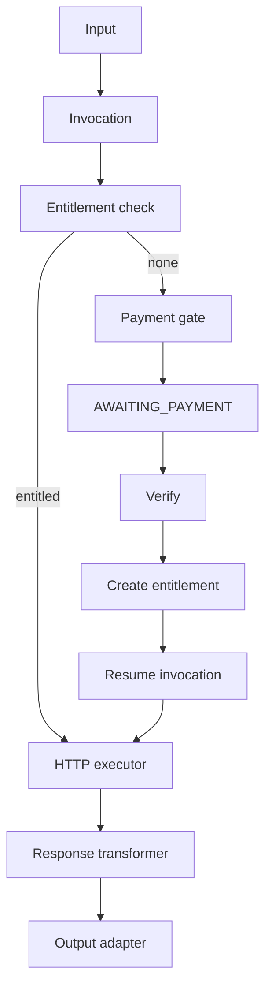
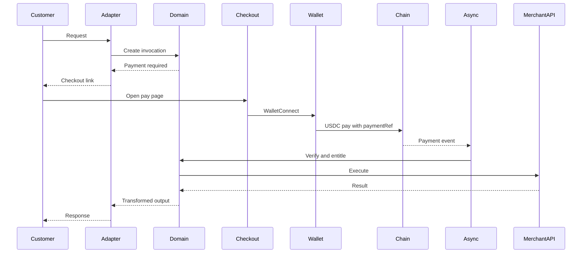

# Invocation flow

All channels become one domain pipeline. Adapters translate. They do not price, verify, or call the merchant API on their own.

Terms: [glossary](../architecture/glossary.md). Payments: [payment flow](payment-flow.md).

## Pipeline

Input → Invocation → Entitlement check → Payment gate → Payment verification → HTTP executor → Response transformer → Output adapter

Adapters enter at Input and leave at Output. Core owns every box in between.

## Happy path across channels

The customer should not repeat the original command after paying.

## Step details

### 1. Input

The adapter extracts typed fields from the channel:

- Telegram: command + argument string mapped to InputSchema
- MCP: tool arguments
- HTTP: JSON body
- Checkout-only: not an invoke; it only completes payment for an existing invocation

Validation failures return a channel-native error. They do not create a payment.

### 2. Invocation

Domain writes an invocation pinned to `endpoint_version_id`, stores C3 input, stores C4 service identity by reference, returns `request_id`. Durable Object `invocation_id` is created for later exclusive fulfillment.

### 3. Entitlement check

Look up a valid unused entitlement for this invocation’s policy. MVP: `PER_REQUEST` means there is no standing credit. Almost every call creates a payment unless a resume after `PAID` is in progress.

Reserved for later: `CREDIT_PACK`, `SUBSCRIPTION`, `ONE_TIME_UNLOCK`. Schema may have `pricing_type`. Code must not implement those paths yet.

### 4. Payment gate

If no entitlement: `CreatePayment`, state `AWAITING_PAYMENT`, return checkout URL and amount. Adapter sends that to the customer (Telegram button, HTTP 402, MCP payment required).

### 5. Verification

Async consumer and PaymentProvider. See [payment flow](payment-flow.md). Success creates a single-use entitlement bound to this invocation (MVP).

### 6. HTTP executor

Runs only with an entitlement claim. Loads C2 secrets, renders the structured request from the EndpointVersion, applies SSRF policy, enforces timeout and size. Never `curl | sh`.

### 7. Response transformer

MVP options: JSON passthrough, JSONPath-style selection, text template. Merchant API responses are untrusted. Templates cannot execute JavaScript. Previews in the dashboard escape output.

### 8. Output adapter

Telegram message, MCP tool result, or HTTP 200 JSON. Failures become `invocation.failed` webhooks without C5 fields.

## Channel notes

### Telegram

Merchant stores a bot token once. Command maps to an endpoint. User: `/search John Smith` → invocation `query=John Smith`. Bot replies with price and Pay. After WalletConnect, the **same** invocation resumes; the user does not resend `/search`.

Telegram is an adapter. Production launch still requires a review of Telegram’s paid digital goods rules. Architecture must not depend only on Telegram.

Implementation: [telegram.md](telegram.md).

### MCP

The same endpoint is a tool: `person_search(query: string)` plus description and price metadata. Discovery, payment requirement, authorization, and execution are separate steps. Merchant tools must not contain chain details.

Spending policy (`max_per_call`, `max_per_day`, allowlists, budgets) is designed for later. MVP must not silently spend.

Cloudflare `McpAgent` Durable Objects are an acceptable transport. Entitlement logic stays in `packages/core`.

### HTTP 402

`POST /v1/invoke/{endpoint}` without entitlement returns `402` and Obscurus-native payment details including `checkout_url`. After entitlement, `200` with `{ "result": ... }`. x402 compatibility is a later envelope ([ADR-0010](../architecture/decisions.md#adr-0010--http-402-is-obscurus-native-x402-aware)).

## Invariants

1. No merchant API call without a claimed entitlement.
2. One single-use entitlement → at most one successful executor run.
3. Adapters are replaceable. Core does not import them.
4. Resume uses stored invocation id, not a reconstructed guess from the chat message.

## Failures

| Failure | Invocation | Payment | Customer |
| ------- | ---------- | ------- | -------- |
| Invalid input | not created or `FAILED` early | none | error |
| Expired unpaid | `FAILED` or closed | `EXPIRED` | expire copy |
| Verify fail | remains waiting or `FAILED` | `FAILED` | retry or support |
| Merchant API error | `FAILED` after claim policy | `PAID` | error; payment not silently undone |
| Adapter delivery fail | `FULFILLED` or delivery-retry | `PAID` | retry delivery without re-calling merchant if output was stored |

Refunds are not implemented. Do not invent automatic refunds on merchant 500s without an ADR.
