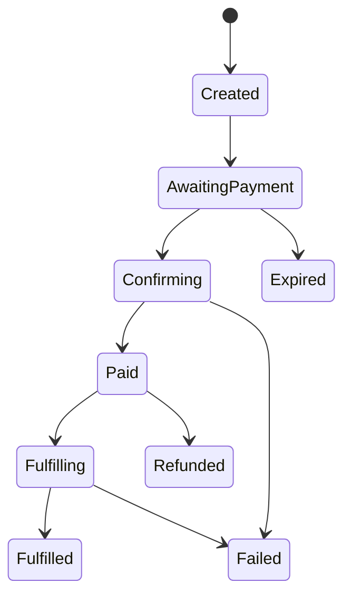
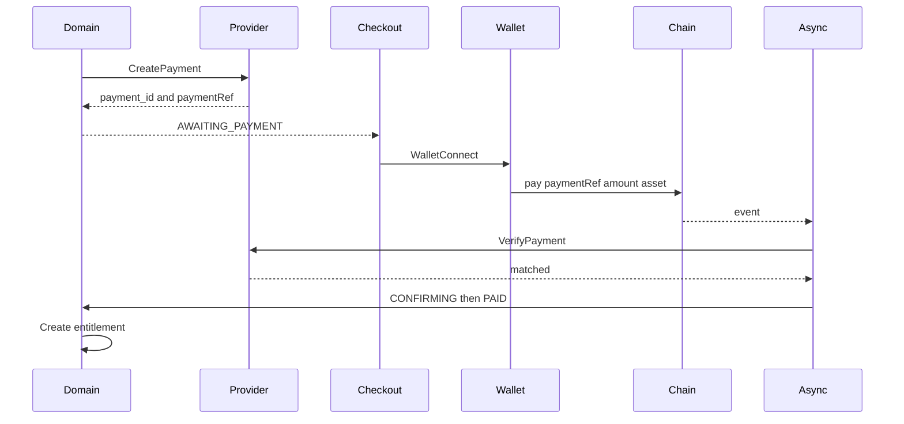

# Payment flow

Payments are a state machine plus a PaymentProvider. Chain details stay in an adapter. Phase 1 uses `MockPaymentProvider`. Phase 5 adds EVM.

Invocation resume is described in [invocation flow](invocation-flow.md). Privacy of payment identity is in the [privacy model](../privacy/privacy-model.md).

## States

Persisted strings:

`CREATED` → `AWAITING_PAYMENT` → `CONFIRMING` → `PAID` → `FULFILLING` → `FULFILLED`

Also: `FAILED`, `EXPIRED`, `REFUNDED`.



`REFUNDED` exists in the model. `Refund()` is not implemented in the MVP.

## Provider interface

```
CreatePayment(input) -> Payment
VerifyPayment(payment_id) -> Verification  // idempotent
GetPayment(payment_id) -> Payment
Refund(payment_id) -> not implemented
```

`CreatePayment` input: merchant, endpoint version, amount, asset, opaque correlation to invocation, expiry. No Telegram IDs. No wallet required at create time.

`VerifyPayment` output: matched or not, tx identifiers if any. Core maps that onto the state machine. Core never parses Solidity logs.

## Happy path



## Rules

1. **Idempotent verify.** Two events, two queue deliveries, two polls: one `PAID`, one entitlement.
2. **Idempotent fulfill.** See invocation Durable Object.
3. **Amount and asset must match.** Wrong amount is `FAILED`, not a partial entitlement.
4. **Unique `paymentRef`.** Reuse on-chain is rejected by the contract and by D1 unique indexes.
5. **Expiry.** Durable Object alarm plus cron sweep moves `AWAITING_PAYMENT` to `EXPIRED`. Checkout refuses expired ids.
6. **No client truth.** Checkout, Telegram, and MCP may *ask* status. They may not *set* `PAID`.

## Mock provider (Phase 4)

`packages/core` ships an in-memory `MockPaymentProvider` for unit tests. The platform Worker persists the same states in D1. `POST /v1/pay/:id/mock-complete` marks the next verify as matched and is forbidden when `ENVIRONMENT=production`. Never use the mock as the production chain adapter.

Verify is idempotent: two matched events produce one `PAID` and one unused entitlement. Fulfill claims that entitlement and runs the HTTP executor at most once.

## EVM provider (Phase 5)

Network and asset: Base Sepolia, Circle USDC `0x036CbD53842c5426634e7929541eC2318f3dCF7e`.

Implemented in [`contracts/`](../../contracts/README.md) as `ObscurusPay` (Foundry, OpenZeppelin, no proxy):

- `pay(bytes32 paymentRef, address merchant, address asset, uint256 amount)`
- Pulls the constructor USDC, sends `amount - fee` to merchant, `fee` to treasury
- Emits `PaymentReceived(paymentRef, merchant, asset, amount, fee)`
- Reverts on duplicate `paymentRef`, wrong asset, zero amount, or `feeBps` above 10%
- Constructor reverts on Ethereum mainnet and any chain other than Base Sepolia / Anvil

Never stored on-chain: Telegram IDs, names, emails, query text, API arguments, merchant API URLs.

Admin: owner may set treasury, `feeBps` (capped), and pause. There is no withdraw or token rescue. Independent audit before mainnet. **Do not deploy mainnet.**

The Worker still verifies events (`paymentRef`, asset, amount) before `PAID`. A Solidity adapter is not wired into `PaymentProvider` yet.

WalletConnect **AppKit** is the wallet connection. Obscurus is the processor. Not WalletConnect Pay.

Testnet confirmation: inclusion ([ADR-0018](../architecture/decisions.md#adr-0018--testnet-confirmation-is-inclusion)). Mainnet depth is a separate ADR.

## Checkout

Route: `/pay/{payment_id}` in `apps/checkout`.

Shows service name, amount, asset, Pay with Wallet (WalletConnect AppKit), the **What is shared?** privacy inspector, and Protected by Obscurus. No Obscurus account. No Apple Pay, cards, or custodial balance.

The inspector lists what the merchant receives (paid amount, service, input — not the customer wallet) and what a public chain observer can see (payer wallet, settlement address, amount, opaque `paymentRef`). It does not claim untraceable money.

WalletConnect connects the wallet. After the customer calls `ObscurusPay.pay`, the page verifies and fulfills through the platform API. The pay page does not call the merchant API itself.

Without a WalletConnect project id and deployed contract, local development uses `mock-complete`. That path is forbidden in production.

## Protocol fee

`feeBps` and treasury address are configurable. The numeric rate is not chosen. Tests may use a placeholder.

## What merchants see

Payment list: time, endpoint, amount, asset, state, `payment_id`. Not wallet. Webhook `payment.confirmed` uses the same fields.

## Settlement

MVP: direct to merchant address in the payment transaction, minus fee. Public chain link exists. Aggregated or shielded settlement is Phase 25 research, not a hidden flag.
